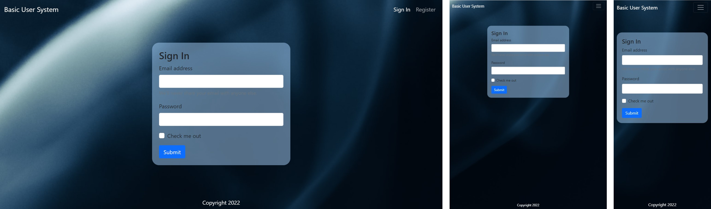

# Basic User System using Express (Nodejs)

## Project Description
This is a project is an exercise for Express (Nodejs). The idea of this project is to create a registration and sign in for user that will be save to a database (MySQL).

## Objective
- understand / familiarize myself in using express(nodejs)
- setup database
- add/edit/delete user
- add login 

## Demo (Coming Soon)

## Screenshoot
- Sign in (Desktop to Mobile View)
  

## Language used
- HTML 5 with EJS
- CSS3
- Bootstrap
- Javascript
- MySQL

## Sources
- I watched this [Node.js and Express.js - Full Course](https://youtu.be/Oe421EPjeBE) by [freeCodeCamp.org](https://www.youtube.com/channel/UC8butISFwT-Wl7EV0hUK0BQ). It is realy helpful to better understand the fundamentals of Node.js and Express.js 
- I found this [website](https://www.blog.duomly.com/node-js-project-ideas-for-beginners/) for Express / Nodejs project ideas
